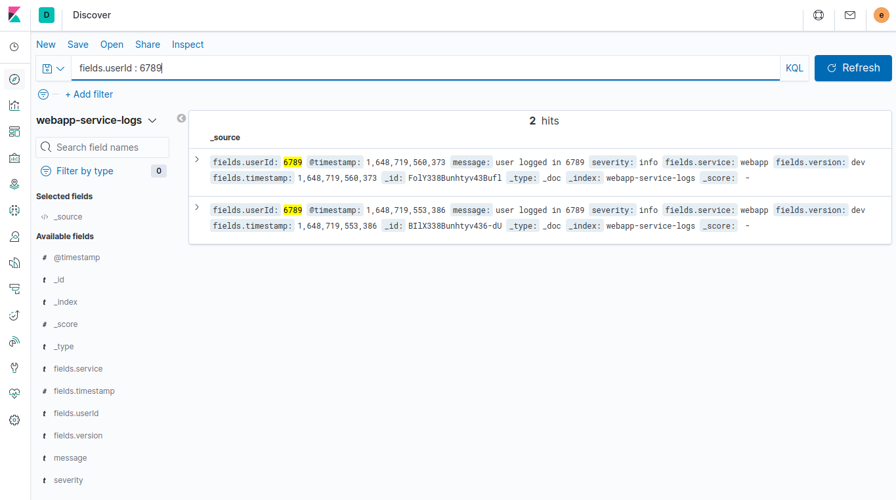

structured logging

Kibana is available at http://localhost:5601

Run webapp once to generate logs to elasticsearch

then go to `Settings > Index Patterns > Create index pattern` in Kibana and create an index pattern for `webapp-service-logs`


---

[./webapp/src/index.js](./webapp/src/index.js)

```js
const logger = require("./logger")

logger.info("service started")

logger.info("user logged in {userId}", { userId: "12345" })
logger.info("user logged in {userId}", { userId: "56789" })
logger.info("user logged in {userId}", { userId: "34567" })

logger.info("user logged out {userId}", { userId: "12345" })
logger.info("user logged out {userId}", { userId: "56789" })
logger.info("user logged out {userId}", { userId: "34567" })

logger.info("service stopped")
```

---

Log entries:

```
{"level":"info","message":"service started","service":"webapp","timestamp":1648721767732,"version":"dev"}
{"level":"info","message":"user logged in 12345","service":"webapp","timestamp":1648721767735,"userId":"12345","version":"dev"}
{"level":"info","message":"user logged in 56789","service":"webapp","timestamp":1648721767735,"userId":"56789","version":"dev"}
{"level":"info","message":"user logged in 34567","service":"webapp","timestamp":1648721767735,"userId":"34567","version":"dev"}
{"level":"info","message":"user logged out 12345","service":"webapp","timestamp":1648721767735,"userId":"12345","version":"dev"}
{"level":"info","message":"user logged out 56789","service":"webapp","timestamp":1648721767735,"userId":"56789","version":"dev"}
{"level":"info","message":"user logged out 34567","service":"webapp","timestamp":1648721767735,"userId":"34567","version":"dev"}
{"level":"info","message":"service stopped","service":"webapp","timestamp":1648721767736,"version":"dev"}
```


---

## Search logs by metadata fields in Kibana



## Kibana metrics

Unique users who have logged in recently


Users' logged in count


